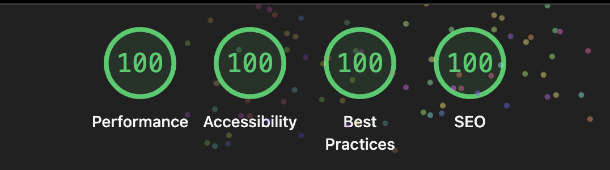

# 🚀 Portfolio - Sebastian Bravo

> Modern, fast, and accessible portfolio built with Astro, TailwindCSS, and TypeScript

[](https://astro.build)
[](https://tailwindcss.com)
[](https://www.typescriptlang.org)

## 🏆 Perfect Lighthouse Scores

Achieving **100% scores across ALL metrics** - Performance, Accessibility, Best Practices, and SEO.



## ✨ Features

- ⚡ **Lightning Fast** - Optimized performance with Astro
- ♿ **Fully Accessible** - WCAG AA compliant
- 🌍 **Internationalization** - Spanish & English support
- 🌓 **Dark Mode** - System preference detection
- 📱 **Responsive** - Mobile-first design
- 🎨 **Modern UI** - Clean animations and glassmorphism
- 🚀 **View Transitions** - Smooth page navigation

## 🛠️ Tech Stack

- **Framework:** Astro 5
- **Styling:** TailwindCSS v4
- **Language:** TypeScript
- **Fonts:** Onest Variable
- **SEO:** astro-seo

## 🚀 Quick Start

```bash
# Install dependencies
pnpm install

# Start dev server
pnpm dev

# Build for production
pnpm build

# Preview production build
pnpm preview
```

## 📁 Project Structure

```
src/
├── components/       # Astro components
│   └── ui/          # Reusable UI components
├── content/         # Markdown content (projects, work)
├── layouts/         # Page layouts
├── lib/             # Utils and configs
├── pages/           # Routes (file-based)
└── styles/          # Global styles
```

## ⚙️ Configuration

### Personal Info

Update `src/lib/data.ts`:

```typescript
export const personalInfo = {
  name: 'Your Name',
  email: 'your@email.com',
  github: 'https://github.com/yourusername',
  // ...
}
```

### Theme Colors

Customize in `src/styles/global.css`:

```css
:root {
  --background: 0 0% 98%;
  --foreground: 240 10% 3.9%;
  --primary: 221.2 83.2% 45%;
}
```

### Add Content

Create projects in `src/content/projects/es/`:

```markdown
---
title: "Project Name"
description: "Description"
tags: ["React", "TypeScript"]
githubUrl: "https://github.com/..."
liveUrl: "https://..."
---

Project details...
```

## 🎯 Performance

- ✅ Performance: 100/100
- ✅ Accessibility: 100/100
- ✅ Best Practices: 100/100
- ✅ SEO: 100/100

## 📦 Deployment

```bash
# Build
pnpm build

# Deploy to Vercel
vercel --prod
```

## 📄 License

MIT License - feel free to use for your own portfolio!

## 👤 Contact

- **GitHub:** [@sebitabravo](https://github.com/sebitabravo)
- **Email:** hello@sebastianbravo.dev
- **LinkedIn:** [Sebastian Bravo](https://linkedin.com/in/sebitabravo)

---

<div align="center">
  <strong>Built with ❤️ using Astro, TailwindCSS, and TypeScript</strong>
</div>
