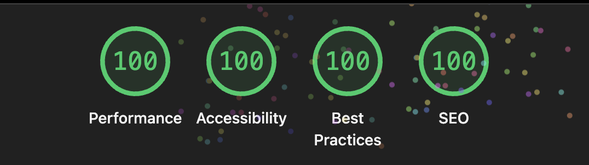

# Portfolio - Sebastian Bravo

> Modern, fast, and accessible portfolio built with Astro, TailwindCSS, and TypeScript

[](https://astro.build)
[](https://tailwindcss.com)
[](https://www.typescriptlang.org)

## Lighthouse Scores

**100/100** across all metrics - Performance, Accessibility, Best Practices, and SEO.



## Features

- **Lightning Fast** - Static site generation with Astro
- **Internationalization** - Spanish & English (`/` and `/en`)
- **Dark Mode** - Light, dark, and system preference
- **Responsive** - Mobile-first design
- **Image Optimization** - Automatic WebP/AVIF via `astro:assets`
- **View Transitions** - Smooth page navigation
- **Contact Form** - Functional form with validation and feedback states
- **SEO Ready** - Automatic sitemap + robots + JSON-LD schema
- **Quality Gates** - Vitest smoke tests + link validation in CI

## Tech Stack

- **Framework:** Astro 5
- **Styling:** Tailwind CSS v4 (CSS-first config)
- **Language:** TypeScript
- **Images:** Sharp
- **SEO:** astro-seo

## Quick Start

```bash
pnpm install
pnpm dev
```

## Testing

```bash
pnpm test
pnpm validate:links
```

## CI/CD

- **Primary quality gate:** `.github/workflows/ci.yml` on PRs and pushes to `main` (unit tests, Playwright E2E, link validation, and build).
- **Lighthouse audit:** `.github/workflows/lighthouse.yml` runs as an informational workflow with `continue-on-error: true` and manual trigger support via `workflow_dispatch`.
- **Official deployment source:** Vercel native GitHub integration (no GitHub Actions deploy workflow).

## Project Structure

```
src/
├── assets/           # Images and files (optimized by Astro)
├── components/       # Astro components
│   ├── icons/        # SVG icon components
│   └── ui/           # Reusable UI components (Card, Button, Badge)
├── data/             # Static data (technologies list)
├── layouts/          # Page layout
├── lib/
│   ├── data.ts       # Portfolio content (experience, projects, education, certifications)
│   └── i18n/         # Translations (es.json, en.json)
├── pages/
│   ├── index.astro   # Spanish home (/)
│   └── en/index.astro # English home (/en)
├── styles/           # Global CSS with theme variables
└── types/            # TypeScript type definitions
```

## Build

```bash
pnpm build
pnpm preview
```

## Contact

- **GitHub:** [@sebitabravo](https://github.com/sebitabravo)
- **Email:** hello@sebastianbravo.dev
- **LinkedIn:** [Sebastian Bravo](https://linkedin.com/in/sebitabravo)
